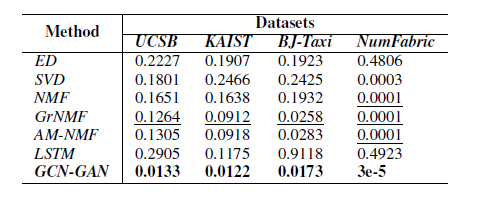

# 5G-Network-Optimization-using-Intent-Based-Networking
Network Automation using Intent-Based Networking

## Table of Content
1. [Introduction](#introduction)
2. [Motivation](#Motivation). 
3. [Dataset](#Dataset)
4. [Roadmap](#Roadmap)
5. [FutureWork](#FutureWork)
5. [Results](#Results)


## Introduction.
The automatic control over the network platform is an admired requirement of the network operators. The Fifth generation network provides a wide range of services with high bandwidth, greater reliability, excellent performance, and latency. The 5G technology can be optimized by Intent-Based networking, IBN supports network orchestration, automatic provision, the configuration of the servers, allocations of the resources, rerouting the path. I tend to propose the Intent-Based networking model with its flow according to the stages. Additionally, I  will also talk about how IBN tools are the key factor for network slicing to provide higher-level network configuration. Secondly, I have proposed the GAN algorithm for network optimization and predicting dynamic traffic and resource allocation. To verify the model’s effectiveness I will conduct the evaluation from the datasets to check network systems and applications scenarios adding that I will employ LTSM to classify new evolving features of a dynamic network.  
## Motivation
The traditional operation and maintenance management methods are characterized by high labor cost, error probability, backward hauling, and network maintenance methods, and low management efficiency becomes difficult for the Network operators (NOs). To cater to this problem, the network itself should be smart enough to resolve the problem very efficiently. The optimization of the 5G network can be achieved by Intent-based Networking. With the introduction of intent-based networking, the new network can cope with the dynamic and ever-changing demand of the network. The management of the network would be efficient using Intent-Based Networking as it can is to reduce manual administration such as changing configurations, reducing traffic, resource allocation, and implementing security controls.

## Dataset.
To evaluate the effectiveness and the accuracy of the model I have considered the dataset from the crawdad with the number of nodes, number of timeslices, and the maximum number of traffic. 1https://crawdad.org/ucsb/meshnet/20070201/

## Dependencies
```
import tensorflow as tf
import numpy as np
from tensorflow.contrib import rnn

```
## Roadmap
The fifth generation of mobile technology bonds to increase speed, lower latency, higher capacity, and higher reliability capacity. 5G network will result in several of today’s technologies such as smart cities, connected infrastructure, autonomous driving, seamless virtual, augmented reality, artificial intelligence, and Internet of Machines and Things. According to findings, the 5G network will be optimized using Intent-Based networking(IBN), IBN is developing technology that will help to replace the manual process of configuring the networks, and responding to the networks issues if the network operator will mention the intent of the IBN will execute the task. The huge infrastructure of the 5G network is complex so the slices have been created and on the slices, IBN tools have been deployed.  The standards of network automation are to reduced the human effort and make networks intelligent hence by GAN deep learning module this can be achieved. Additionally, I also want to add the feature of dynamic prediction of the network to formulate the dynamic traffic prediction in the infrastructure to enhance the real-world dynamic network.


## Futurework.
The shortcoming of the study is that the IBN network is very complex as it involves an Artificial intelligence algorithm, so it is prone to make mistakes and it also involves multiple operating systems, environment, and network components. Secondly, the success rate of IBN systems depends on the API as the network's access lies within the API. To overcome the shortcomings and make the IBN work for the 6G network it needs to be changed in many aspects considering integrating with space, ground, and sea communication with AI-based wireless network will play a key role in future network automation and in aspects to optimize the 6G network.
## Results




