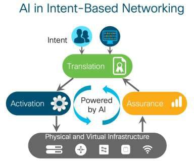
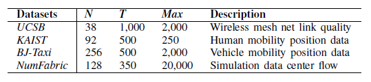
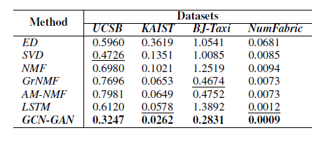
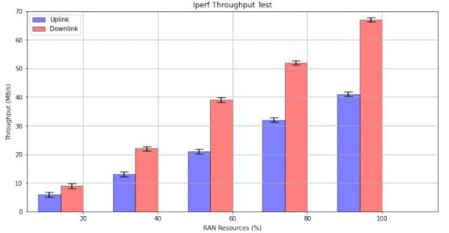

# 5G-Network-Optimization-using-Intent-Based-Networking
Network Automation using Intent-Based Networking

## Table of Content
1. [Overview](#Overview)
2. [Motivation](#Motivation) 
3. [Dataset](#Dataset)
4. [Installation](#Installation)
5. [Hypothesis](#hypothesis) 
6. [Methodology](#Methodology)
6. [Results](#Results)
7. [Future Work](#Future-Work)


## Overview.
The automatic control over the network platform is an admired requirement of the network operators. The Fifth generation network provides a wide range of services with high bandwidth, greater reliability, excellent performance, and latency. With the same physical infrastructure, the older network was unable to accommodate the varied services. As an outcome network virtualization offers a solution named network slicing that supports service variability and provides isolation of resources to each service. Network slicing allows network administrators to construct numerous logical networks using the same physical infrastructure. The 5G technology can be optimized by Intent-Based networking, IBN supports network orchestration, automatic provision, the configuration of the servers, allocations of the resources, rerouting the path. In this document, I have compared the studies of network optimization and have given my hypothesis to optimize the network more efficiently. The method proposed to use the GAN model at the core network has given more efficiency to the network and has optimized the network additionally it can predict the dynamic traffic and resource allocation. IBN tools are key factors for network slicing to provide higher-level network configuration. . IBN tools can control the network, monitor the network slice, and manage the network.


 


## Motivation
The traditional operation and maintenance management methods are characterized by high labor cost, error probability, backward hauling, and network maintenance methods, and low management efficiency becomes difficult for the Network operators (NOs). To cater to this problem, the network itself should be smart enough to resolve the problem very efficiently. The optimization of the 5G network can be achieved by Intent-based Networking. With the introduction of intent-based networking, the new network can cope with the dynamic and ever-changing demand of the network. The management of the network would be efficient using Intent-Based Networking as it can is to reduce manual administration such as changing configurations, reducing traffic, resource allocation, and implementing security controls.

## Dataset.
To evaluate the effectiveness and the accuracy of the model I have considered the dataset from the crawdad with the number of nodes, number of timeslices, and the maximum number of traffic. 1https://crawdad.org/ucsb/meshnet/20070201/


## Installation 
The project Optimization of 5G network using Intent-Based Networking can be implemented by using Pycham IDE. Pycharm can be downloaded by using this [link](https://www.jetbrains.com/help/pycharm/installation-guide.html) and follow the instructions given below.
 
 • Download the Pycharm Community

 • Install the .exe file  
 • Open a Network Optimaztion project. 

 


## Libraries
```
import tensorflow as tf
import numpy as np
from tensorflow.contrib import rnn

```

## Hypothesis
The automatic control over the network is a very efficient and effective way to solve the problem of a fifth-generation network. To make the network automatic many algorithms and have been used prior as the fifth-generation network is still evolving and still needs to make more progress. The previously GCN-GAN algorithm has been used to make the network automatic and lesser prone to network fault and proper network management, But somehow the GAN model can collapse as the generator can cave in and will produce a limited amount of samples for the discriminator. Secondly considering the slice and network infrastructure the GAN model deployed at the core slice might be prone to collapse.  So if, the Trans-DLR (dynamic learning rate) model would have been used at the core network infrastructure then so that DLR can incorporate the knowledge representation learning which can help to adapt the dynamic learning rate with the help of the IBN tools.

## Methodology
I have collated the study of two models based on the Advanced deep learning module that represents how the Generative Adversarial Nets would help to the dynamic rate of network on the core slice of the network with the help of the IBN tools and will make the network efficient and help the resource allocation very efficient, and the other study is to predict the dynamic traffic rate using GCN-GAN model. 


## Results
Results sections state that the GAN model used at the network core using IBN tools and slice created according to the user Intent/contract has shown an efficient result. The QoS requirement of slice one as per user intent translated into the contract was specified at 40MB/s downlink speed and 20MB/s uplink speed for eMBB slice, the second slice of IoT had downlink speed of 40MB/s and 20MB/s uplink speed, and for the third slice of URLLC had a downlink of 20MB/s and uplink of 10MB/s. Secondly, the result of the second study has compared the GAN model with the traditional model and the GAN model has outperformed all the traditional models in terms of accuracy and efficiency. 




Secondly, the result of the second study has compared the GAN model with the traditional model and the GAN model has outperformed all the traditional models in terms of accuracy and efficiency. 




SO I have given the hypothesis that if the Trans-DLR would have used on the core network then the results and accuracy of the resources allocation and deploy would have improved. The advantage of the study and hypothesis mentioned, the abstraction and the isolation of the network will lead to the separation of the logical network components from the network resources and will enhance the performance. Secondly, IBN will system will provide speed and agility to the core network, so the retort time can be increased to meet the intent of the user. The Trans-DLR will provide more stability to the network as the GAN model might collapse but the Trans-DLR will provide enough amount of sample to the discriminator. 


## Future Work.
The 5G network is still evolving around the globe and testing is under process and the hypothesis given is still on the paper still has not been implemented so the accuracy of the prediction might not be up to the mark. In the future, I will extend my study and implement the Trans-DLR model to compare the accuracy and to deploy it on the core network of the 5G infrastructure. The language unit must be more diverse and the unit of the language should be consequential so that it can able to work in the smaller devices. IBN involves complex operating systems, and network components. The verification and validation module needs to be more precise as the intent of the user will go through this module. 

## Note.

I have done comparative studies of Network optimization and given my hypothesis for the presented study. The results displayed are not mine, as I was not able to implement it on the real infrastructure, and extraction of the dataset was difficult. The implementation of the code has been referenced from the [GitHub Repository](https://github.com/yanghaoxie/GCN-GAN-for-Weighted-Dynamic-Networks)